# Cybersecurity Training Platform

A full-stack cybersecurity training platform built as my senior graduation project for the **Bachelor of Science in Computer Science at Lebanese International University (LIU)**.

The platform combines hands-on **CTF challenges, SOC case simulations, Incident Response scenarios, Docker-based security labs, and structured learning resources** in one application.

The goal of the project was to create a practical environment where learners can practice cybersecurity workflows rather than only study theory.

---

## 🎯 Core Modules

### CTF Challenges

- Practical cybersecurity challenges
- Flag submission and validation
- Challenge timer and lockout handling
- Progress tracking

### SOC Case Simulations

- Investigate simulated security incidents
- Submit analysis and investigation results
- Practice SOC-style workflows

### Incident Response Scenarios

- Multi-step incident investigations
- Ordered response workflow
- Step-by-step submissions and progression

### Learning Center

- Structured cybersecurity learning paths
- Course and lesson progression
- Learning content management

### Docker Labs

- Isolated hands-on security labs
- Practical web-security exercises
- Example **Hidden Comment Lab**

---

## 👤 Platform Features

- User registration and authentication
- Email verification
- Secure password hashing with bcrypt
- JWT-based authentication
- Role-Based Access Control (RBAC)
- User progress tracking
- Leaderboard
- Contact and platform review functionality
- Cybersecurity assistant/chat functionality

### Admin Features

- Manage CTF challenges
- Manage SOC cases
- Manage Incident Response scenarios
- Manage Learning Center content
- Review user submissions
- View administrative insights

---

## 🔐 Security-Focused Implementation

Security was considered as part of the application design, not only as a feature of the training content.

The project includes:

- **bcrypt** password hashing
- **JWT** authentication
- **Role-Based Access Control** for protected administrative functionality
- **Email verification** using time-limited verification tokens
- **Rate limiting** middleware
- Input normalization and validation
- Suspicious/malformed input warnings
- Failed-login attempt tracking and security logging
- Protected API routes and admin authorization

These features gave me practical experience applying security concepts while developing a real application.

---

## 🧰 Technology Stack

### Frontend

- React.js
- Vite
- JavaScript
- HTML5
- CSS3

### Backend

- Node.js
- Express.js
- REST APIs

### Database

- Microsoft SQL Server
- SQL Server Management Studio (SSMS)

### Security

- JSON Web Tokens (JWT)
- bcrypt
- Role-Based Access Control (RBAC)
- Rate limiting
- Input validation
- Email verification

### DevOps / Tools

- Docker
- Git
- GitHub
- Visual Studio Code

---

## 🏗️ Architecture

```text
                    React / Vite Frontend
                              │
                              ▼
                    Express.js REST API
                              │
              ┌───────────────┴───────────────┐
              │                               │
              ▼                               ▼
       Authentication &                 Cybersecurity
       Authorization                    Training Modules
              │                               │
              └───────────────┬───────────────┘
                              ▼
                     Microsoft SQL Server
                              │
                              ▼
                 Progress / Submissions /
                 Challenges / Cases / Users
```

---

## 📸 Platform Screenshots

The screenshots below show the main user workflows, cybersecurity training modules, administrative features, and the integrated Docker lab environment.

### Platform Overview

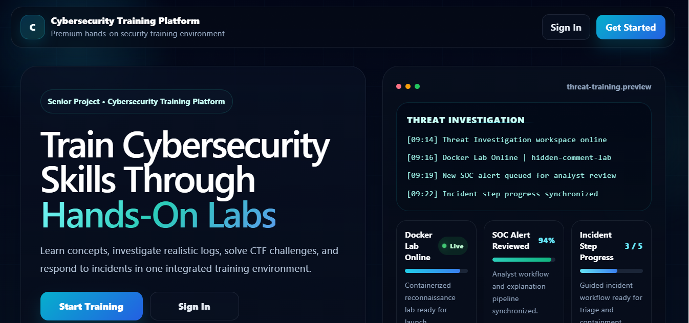

The landing page introduces the platform as a hands-on cybersecurity training environment combining investigation, CTF, and incident-response workflows.

### User Dashboard

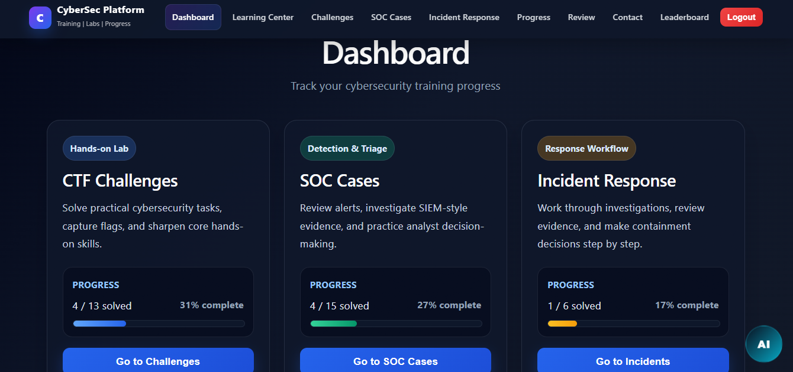

The dashboard brings together CTF challenges, SOC cases, and Incident Response training with progress tracking.

### CTF Challenges

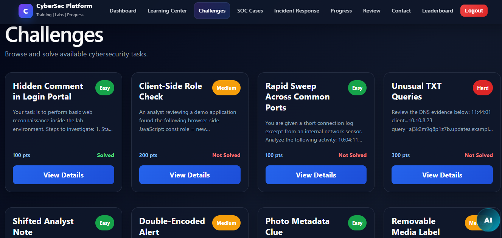

The CTF module provides practical security challenges with difficulty levels, point values, and solve status.

### CTF Challenge Details

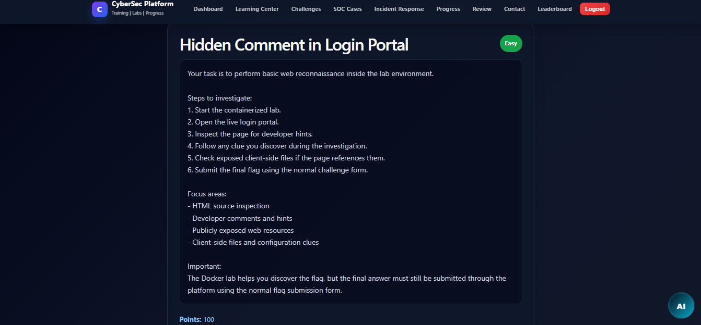

Individual challenges provide investigation instructions and support hands-on lab execution and flag submission.

### SOC Case Analysis

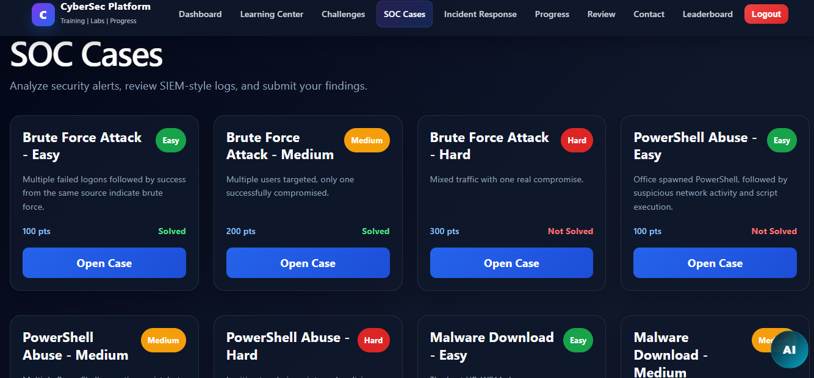

The SOC module presents simulated security alerts and investigation cases for analyst-style practice.

### SIEM-Style Log Investigation

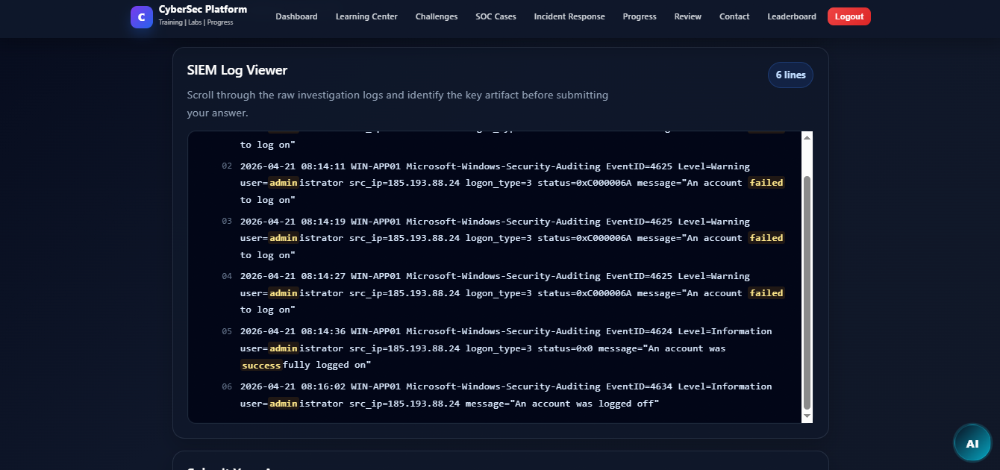

A log-viewing interface presents Windows security audit events and other investigation artifacts for analysis.

### Incident Response

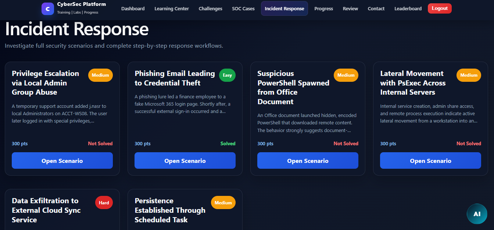

Incident Response scenarios guide users through step-based investigations and response workflows.

### Learning Center


The Learning Center organizes foundational cybersecurity material into structured learning paths and lessons.

### Administration

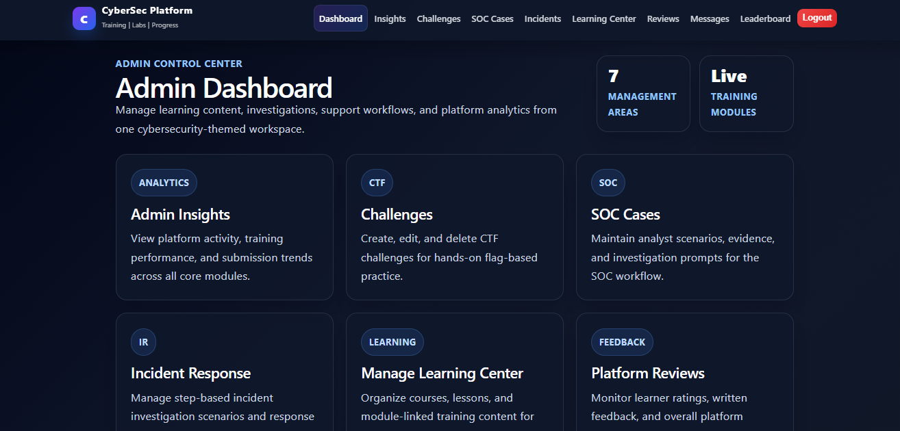

The administrative dashboard provides management areas for challenges, SOC cases, Incident Response, learning content, and platform operations.

### Administrative Insights

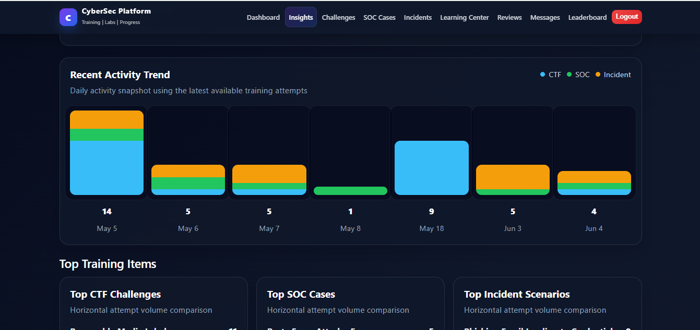

Administrative analytics provide visibility into training activity and performance across the platform's core modules.

### Docker Lab Integration

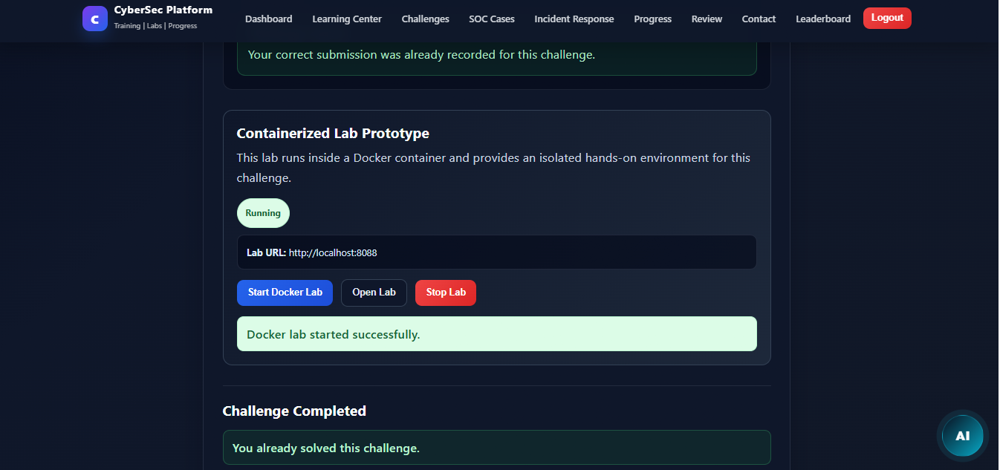

The platform can start and manage an isolated Docker-based lab directly from a challenge workflow.

### Docker Security Lab

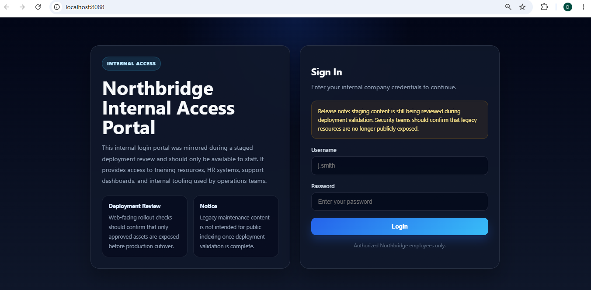

The Hidden Comment Lab runs as an isolated web-security training environment, giving learners a practical reconnaissance and source-inspection exercise.

---

## 📁 Project Structure

```text
cybersecurity-training-platform/
│
├── frontend/                 # React + Vite frontend
├── src/
│   ├── config/               # Database configuration
│   ├── controllers/          # Application/business logic
│   ├── middleware/           # Authentication, authorization, rate limiting
│   ├── routes/               # REST API routes
│   └── utils/                # Validation, security, email utilities
│
├── sql/                      # Database and feature SQL scripts
├── docker-labs/              # Docker-based security labs
├── docs/screenshots/         # Portfolio screenshots
├── package.json
├── package-lock.json
└── README.md
```

---

## 🚀 Running the Project Locally

### 1. Clone the repository

```bash
git clone https://github.com/omaratiehcs/cybersecurity-training-platform.git
cd cybersecurity-training-platform
```

### 2. Backend setup

```bash
npm install
npm start
```

The backend uses environment variables for configuration, including database and authentication settings.

### 3. Frontend setup

```bash
cd frontend
npm install
npm run dev
```

### 4. Database

Create a Microsoft SQL Server database and execute the required SQL scripts from the `sql/` directory.

> **Note:** This repository does not include production secrets. Configure environment variables locally before running the application.

---

## 📚 What I Learned

This project gave me practical experience with:

- Designing and building a full-stack application
- Developing REST APIs with Express.js
- Working with Microsoft SQL Server
- Implementing authentication and authorization
- Applying password hashing and security controls
- Building cybersecurity training workflows
- Containerizing security labs with Docker
- Designing multi-step Incident Response scenarios
- Working with Git and GitHub throughout development

---

## 🔮 Future Improvements

Planned or potential improvements include:

- Multi-factor authentication (MFA)
- Password reset functionality
- More Docker-based labs
- Additional CTF challenges and SOC cases
- Automated testing
- API documentation
- CI/CD pipeline
- Cloud deployment

---

## 📌 Project Status

This project was developed as a university graduation project and is now being maintained as part of my cybersecurity portfolio.

I plan to continue extending it with additional security labs and practical cybersecurity features as I progress through my learning roadmap.

---

## 📄 License

This project is provided for educational and portfolio purposes.
